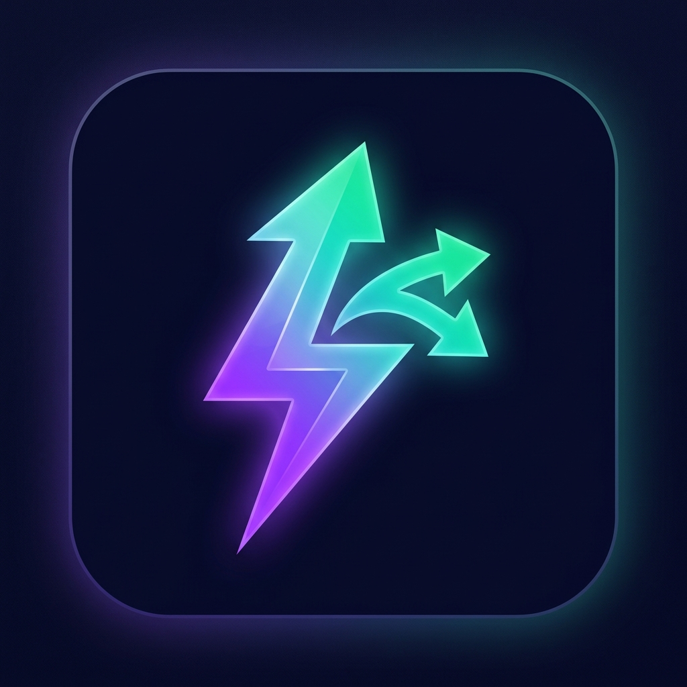

# EZShare — Web-Based P2P File Sharing

> Instant, secure, peer-to-peer file transfer between devices on local network or web — AirDrop & Nearby Share web alternative.



## ✨ Features

- ⚡ **WebRTC Peer-to-Peer Transfer**: Files transfer directly between devices (no server storage).
- 🎨 **Glassmorphism UI**: Modern frosted glass theme with dynamic neon animations.
- 📱 **QR Code & Link Pairing**: Instant device connection by scanning QR code or sharing link.
- 🔒 **Optional PIN Security**: Direct join by default with optional security PIN toggle.
- 📊 **Real-time Transfer Stats**: Speed (MB/s), ETA countdown, and progress bar.
- 📂 **Multi-file Support**: Drag & drop multiple files of any size or type.
- 📲 **PWA Ready**: Installable as a progressive web application on desktop & mobile.

---

## 🚀 Getting Started

### Prerequisites

- [Bun](https://bun.sh) (or Node.js v18+)

### Installation

```bash
# Clone repository
git clone https://github.com/Emmzain/Local-Network-File-Manager-Media-Hub.git
cd Local-Network-File-Manager-Media-Hub

# Install dependencies
bun install
```

### Run Locally

1. **Start Signaling Server**:
```bash
bun run server
```

2. **Start Next.js App**:
```bash
bun run dev
```

3. Open `http://localhost:3000` (or `http://<your-local-ip>:3000` on mobile).

---

## 🛠️ Tech Stack

- **Framework**: Next.js 15 (App Router) + React 19
- **Language**: TypeScript
- **Styling**: Vanilla CSS (Glassmorphism design system) + Framer Motion
- **Signaling**: Socket.IO (Node.js)
- **P2P Transfer**: WebRTC DataChannels
- **QR Code**: `qrcode.react` + `html5-qrcode`

---

## 🔒 Security & Privacy

- Zero files are stored or cached on any server.
- WebRTC transfers are end-to-end encrypted (DTLS/SCTP).
- Temporary signaling sessions expire automatically.
